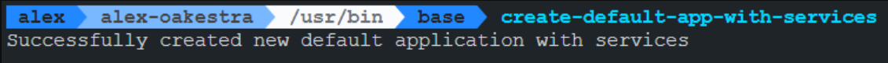

# Login & Create App with Services via default SLA
### Result

The default_SLA can also be found in the main oakestra repo's README.md .

### Note
I am working on a virtualized linux machine. I want to develop python code via VSCode and not VIM (that I use for bash scripts), so I like to call this function via this alias:
`alias create-default-app-with-services='python3 /home/alex/oakestra/alex_utils/create_default_app_with_services.py'`
This can be added to e.g. `/etc/bash.bashrc`

