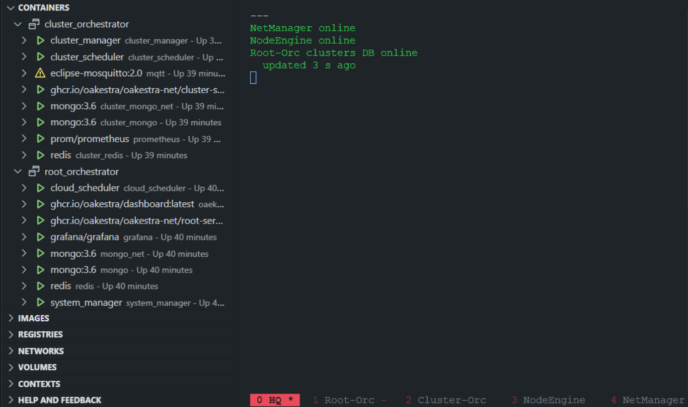

# Rebootable TMUX configuration with cluster management scripts
### Result

Explanation :
- Left side: VSCode Docker Extension 
    - Shows that all necessary contains are running to be able to fully use the Dev-Cluster
- Middle: Looping script checking custom metrics I found useful (optional)
- Bottom: 5 different tmux "tabs/views" in one tmux session
    -  One for each important Oakestra Dev-Cluster component

## Persistent & customized TMUX
- I assume you are familiar with basic TMUX
- Usually TMUX looses all its knowledge like panes or windows after reboot.
- This can be circumvented via different means, this is just one example.
- I am using [TMUX plugin manager](https://github.com/tmux-plugins/tpm)
- And [TMUX ressurect](https://github.com/tmux-plugins/tmux-resurrect)
    - This is the plugin that allows TMUX to reload windows/panes, etc. after boot
    - For this one needs to press a specific shortcut (see docs) to save your current setup and then with another shortcut you are able to (re)load it after boot.
    - So currently after rebooting I run tmux (with nothing loaded yet) and press this shortcut to re-load my setup.
- I tried tmux-continuum but it did not work for me as intended.
    - Here is my TMUX config - it changes the default shortcuts and style too

## Cluster component management - (re)starts & stop
I have written several bash scripts for this and placed them in `/usr/bin/` for each execution/access.

These commands delegate/pipe the commands to the proper tmux windows/tabs so when you switch to them you will see the proper component logs, etc.    

As a result one can (re)start or stop the entire dev-cluster with a single command.

For this to properly work you need to first create these panes/tabs in TMUX by hand, rename them just as shown in the screenshot (or as specified in the scripts) and save this setup via the TMUX ressurect shortcut. 
    
- If people should be interested I can write a new scripts that can automate this as well.

- ro = Root Orchestrator
- co = Cluster Orchestrator
- worker = node engine & net manager
