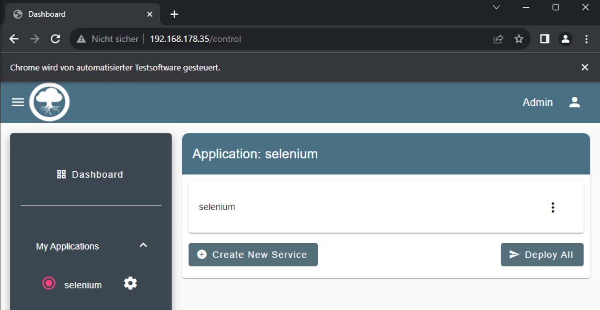

# Login & create an application
Uses [Selenium](https://www.selenium.dev/) as an auto-clicker/web-crawler to interact with a chrome browser.

Automatically opens a chrome browser and clicks through the neccesary parts to log-in, create a default application with services. Can be easily extended.

[Great tutorial]((https://www.youtube.com/watch?v=SPM1tm2ZdK4)) that introduces Selenium and how to install and use it.

### Result

